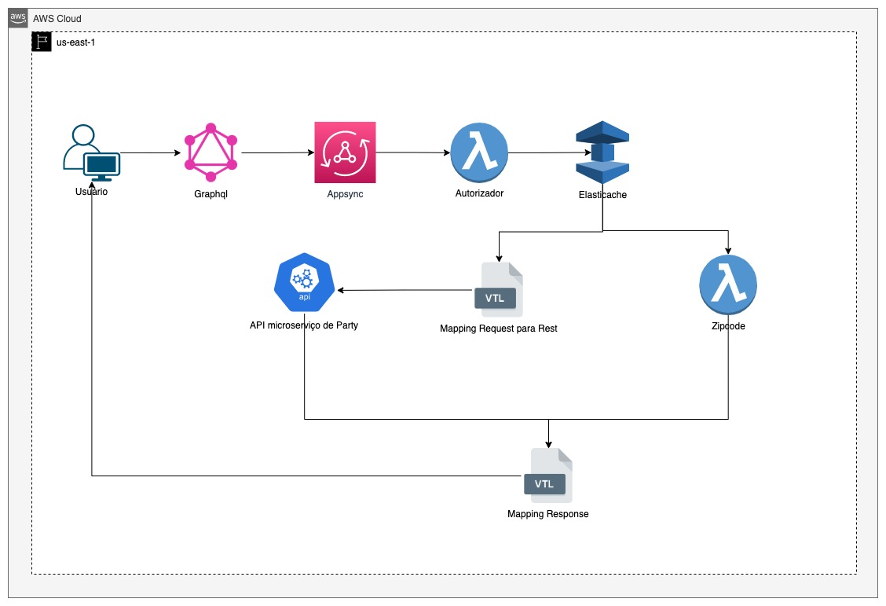
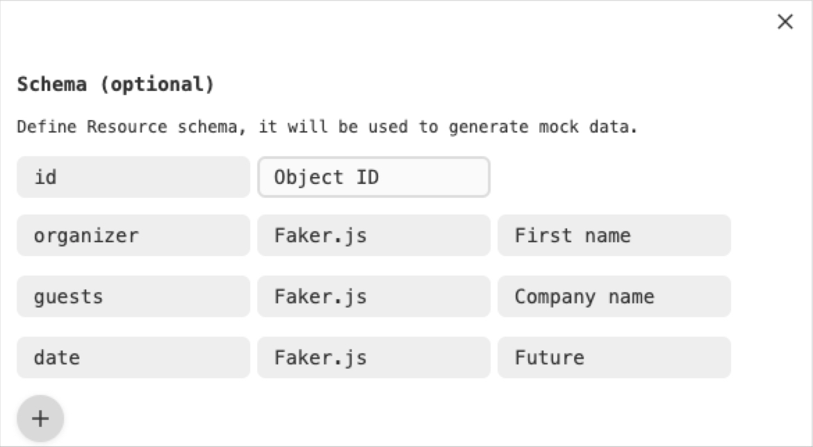
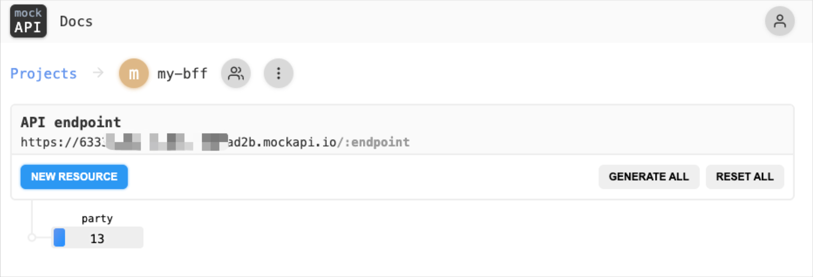
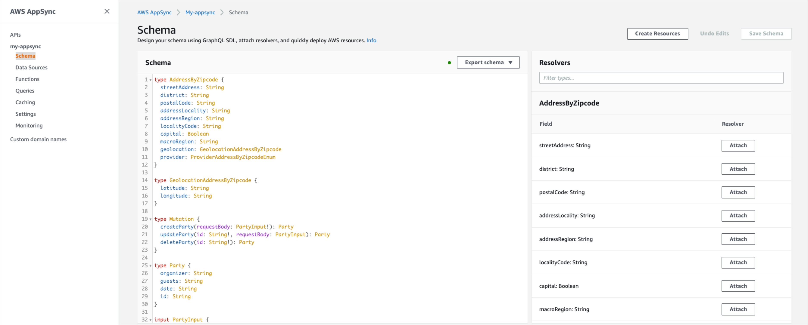
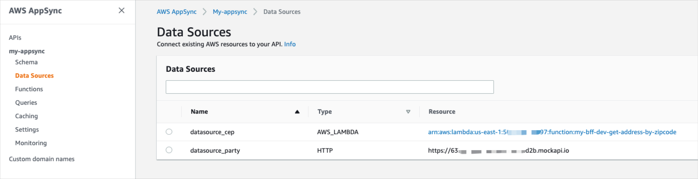
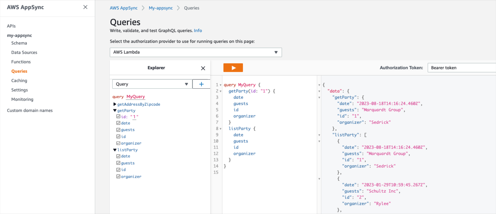
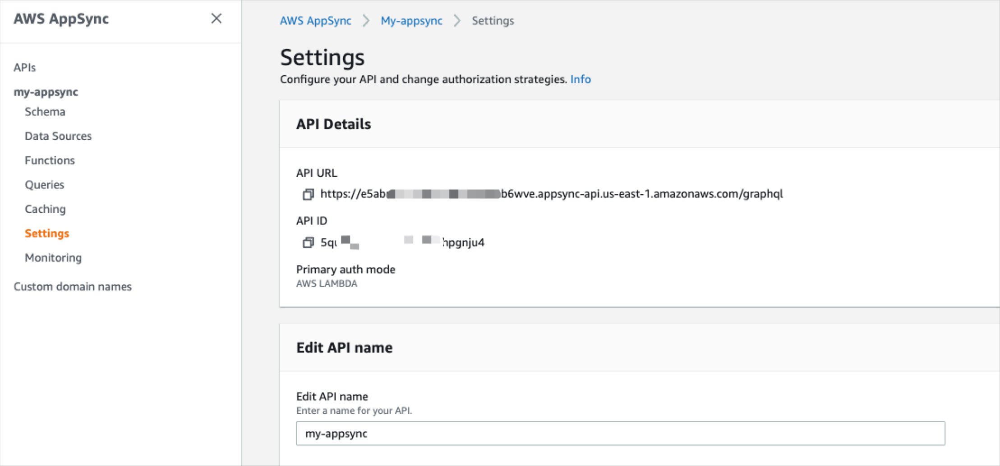
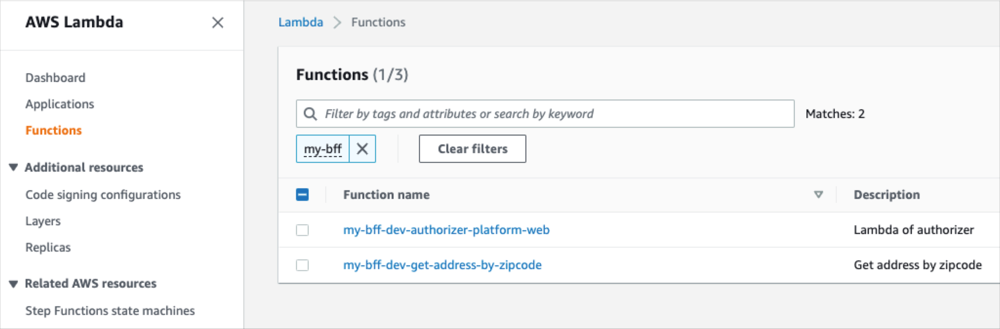
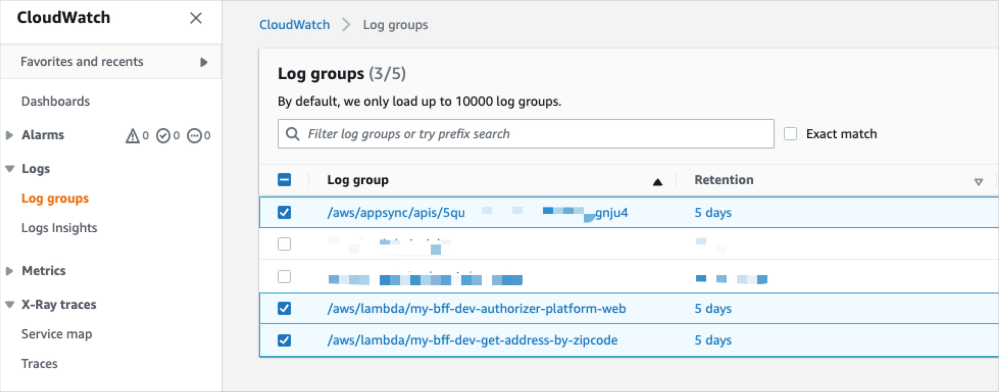

# Construindo um BFF usando o Appsync com serverless

## 📚 Descrição
Este repositório tem como objetivo demonstrar de uma forma simples e objetiva com criar um BFF bem simples com o Appsync via serverless.<br>
Dentro do projeto, foi criado 2 tipos de conexão, sendo uma via HTTP ou seja conectando o nosso Appsync a um microserviço e a outra forma foi conectar com um serviço Lambda.

## 🎯 Fluxo da aplicação


## 🔒 Variáveis de ambiente
Para que a aplicação rode perfeitamente, você precisará das seguintes variáveis de ambiente configurada no projeto

| Environment                  | Descrição                                       | Valor Padrão                          |
| ---------------------------- | ----------------------------------------------- |-------------------------------------- |
| API_ZIPCODE_VIACEP_ENDPOINT  | Endpoint da api do viacep                       | https://viacep.com.br/ws              |
| API_ZIPCODE_AWESOME_ENDPOINT | Endpoint da api do awesomeApi                   | https://cep.awesomeapi.com.br/json    |
| API_MOCK_PARTY               | Endpoint do microserviço fake usando o mockApi  | https://seu-codigo-aqui.mockapi.io    |

## 📌 Faça sua configuração na AWS 
Antes de iniciarmos o projeto, faça o login na [AWS Console](https://aws.amazon.com/pt/) e siga os seguintes passos:
- [1º] Acesse o console da AWS
- [2º] Busque por IAM na barra de pesquisa
- [3º] Crie um usuário apenas para acesso pelas credenciais de acesso ao aws cli
- [4º] Vincule apenas as permissões que você irá precisar para usar os recursos pela aws cli
- [5º] Em seguida adicione essas credenciais em sua máquina, [Clique aqui](https://docs.aws.amazon.com/cli/latest/userguide/cli-configure-files.html) e veja como configurar.

## 📌 Crie um projeto no MockApi
Para não precisarmos ter que criar uma API completa, foi utilizado o mockApi, um site bem completo para criar sua API Fake.
- [1º] Acesse o link: [https://mockapi.io/](https://mockapi.io/)
- [2º] Vá na opção de criar projeto e de o nome dele de `my-bff`
- [3º] Em seguida vá na opção de **NEW RESOURCE** de o nome de `party` e depois adicione as seguintes informações:<br>


- [4º] Deixe o restante tudo padrão e clique em Salvar
- [5º] Em seguira será gerada um endpoint bem parecido como esse: [https://123456789.mockapi.io/](https://123456789.mockapi.io/), copie esse código e coloque em sua variavel de ambiente no projeto com o seguinte nome: `API_MOCK_PARTY`<br>


## 🛠️ Instalação
Você precisa ter instalado as seguintes ferramentas:
- [NodeJs](https://nodejs.org/en/download/)
- [AWS Cli](https://docs.aws.amazon.com/cli/latest/userguide/getting-started-install.html)
- [Serverless Framework](https://www.serverless.com/)
- [Mock Api](https://mockapi.io/)

## 🏃 Para rodar a aplicação basta executar os seguintes comandos

```bash
# NPM 
$ npm install
```

```bash
# Deploy 
$ npx serverless deploy
```

## ✅ Atenção
Não foi instalado nenhuma estrutura para rodar o appsync na máquina local<br>
Acesse a documentação do plugin utilizado para a configuração do appsync no serverless:<br>
[https://www.serverless.com/plugins/serverless-appsync-plugin](https://www.serverless.com/plugins/serverless-appsync-plugin)<br>

Link da documentação do appsync:<br>
[https://docs.aws.amazon.com/pt_br/appsync/latest/devguide/what-is-appsync.html](https://docs.aws.amazon.com/pt_br/appsync/latest/devguide/what-is-appsync.html)

## 🔦 O que está sendo criado:
- [1º] Appsync
- [2º] Lambda
- [3º] Cloud Watch

## 🔗 Como visualizar e testar no console da AWS
Primeiro, faça o login na plataforma da AWS [clicando aqui](https://aws.amazon.com/pt/)
### Visualizando o Appsync

- [1º] Faça uma busca na barra de pesquisa na página principal por (`appsync`)
- [2º] No menu de APIs selecione o nome do seu projeto criado pelo serverless (`my-appsync`)
- [3º] Clique em `Schema`, aqui vamos poder observar como a estrutura de graphql que você construiu via código ficou na plataforma. <br>
<br>

- [4º] Clique em `Data Sources`, esse menu é onde você conseguirá visualizar onde estão suas APIs de seus microserviços que você apontou em seu código no arquivo **serverless.yml** <br>
<br>

- [5º] Clique em `Queries`, dentro desse menu vamos conseguir testar nossas queries, tanto Query quanto Mutation, mas antes disso precisamos adicionar o nosso 
token que criamos lá no arquivo `src/lambdas/authorizer.js` para exemplificar deixar um valor fixo no código como `Bearer token`, depois disso você conseguirá fazer uma consulta por exemplo<br>
<br>

- [6º] Por último clique em `Settings`, é lá onde vai estar as configurações como o link de acesso, configuração de logs, x-ray, configuração de WAF, dentre outros...<br>
<br>

### Visualizando as Lambdas

- [1º] Faça uma busca na barra de pesquisa na página principal por (`lambda`)
- [2º] Clique em `Functions` para conseguir visualizar todas das lambdas que foram construídas pelo appsync, caso você já tenha outros lambas já criados, faça uma pesquisa da seguinte forma: `my-bff`, feito isso você deverá visualizar 2 lambdas, navegue entre elas para conseguir visualizar suas particulariedades <br>
<br>

### Visualizando os logs no Cloud Watch

- [1º] Faça uma busca na barra de pesquisa na página principal por (`cloud watch`)
- [2º] Clique em `Log groups`, dentro dessa opção você conseguirá visualizar todos os logs, para conseguir fazer uma pesquisa mais assertiva já que você pode ter vários logs de outros serviços, pesquise por `appsync` e em seguida `my-bff`, entre dentro de cada um para acompanhar os logs.<br>
<br>

