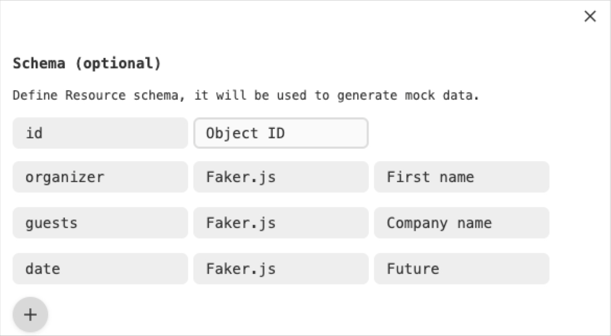
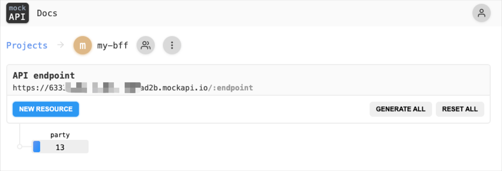

# Construindo um BFF usando o Appsync com serverless

## 📚 Descrição
Este repositório tem como objetivo demonstrar de uma forma simples e objetiva com criar um BFF bem simples com o Appsync via serverless.<br>
Dentro do projeto, foi criado 2 tipos de conexão, sendo uma via HTTP ou seja conectando o nosso Appsync a um microserviço e a outra forma foi conectar com um serviço Lambda.
Além disso foi implementado uma camada de cache automatizada pelo próprio Appsync para poder ajudar na performa da nossa aplicação, e para conseguirmos fazer uma análise mais a funda o modulo de X-ray foi habilitado para fazer todo o trace-id do caminho que foi percorrido.

## 🎯 Fluxo da aplicação


## 🔒 Variáveis de ambiente
Para que a aplicação rode perfeitamente, você precisará das seguintes variáveis de ambiente configurada no projeto

| Environment                  | Descrição                                       | Valor Padrão                          |
| ---------------------------- | ----------------------------------------------- |-------------------------------------- |
| API_ZIPCODE_VIACEP_ENDPOINT  | Endpoint da api do viacep                       | https://viacep.com.br/ws              |
| API_ZIPCODE_AWESOME_ENDPOINT | Endpoint da api do awesomeApi                   | https://cep.awesomeapi.com.br/json    |
| API_MOCK_PARTY               | Endpoint do microserviço fake usando o mockApi  | https://seu-codigo-aqui.mockapi.io    |

## 📌 Faça sua configuração na AWS 
Antes de iniciarmos o projeto, faça o login na [AWS Console](https://aws.amazon.com/pt/) e siga os seguintes passos:
- [1º] Acesse o console da AWS
- [2º] Busque por IAM na barra de pesquisa
- [3º] Crie um usuário apenas para acesso pelas credenciais de acesso ao aws cli
- [4º] Vincule apenas as permissões que você irá precisar para usar os recursos pela aws cli
- [5º] Em seguida adicione essas credenciais em sua máquina, [Clique aqui](https://docs.aws.amazon.com/cli/latest/userguide/cli-configure-files.html) e veja como configurar.

## 📌 Crie um projeto no MockApi
Para não precisarmos ter que criar uma API completa, foi utilizado o mockApi, um site bem completo para criar sua API Fake.
- [1º] Acesse o link: [https://mockapi.io/](https://mockapi.io/)
- [2º] Vá na opção de criar projeto e de o nome dele de `my-bff`
- [3º] Em seguida vá na opção de **NEW RESOURCE** de o nome de `party` e depois adicione as seguintes informações:<br>

- [4º] Deixe o restante tudo padrão e clique em Salvar
- [5º] Em seguira será gerada um endpoint bem parecido como esse: [https://123456789.mockapi.io/](https://123456789.mockapi.io/), copie esse código e coloque em sua variavel de ambiente no projeto com o seguinte nome: `API_MOCK_PARTY`


## 🛠️ Instalação
Você precisa ter instalado as seguintes ferramentas:
- [NodeJs](https://nodejs.org/en/download/)
- [AWS Cli](https://docs.aws.amazon.com/cli/latest/userguide/getting-started-install.html)
- [Serverless Framework](https://www.serverless.com/)
- [Mock Api](https://mockapi.io/)

## 🏃 Para rodar a aplicação basta executar os seguintes comandos

```bash
# NPM 
$ npm install
```

```bash
# Deploy 
$ npx serverless deploy
```

## ✅ Atenção
Não foi instalado nenhuma estrutura para rodar o appsync na máquina local<br>
Acesse a documentação do plugin utilizado para a configuração do appsync no serverless:<br>
[https://www.serverless.com/plugins/serverless-appsync-plugin](https://www.serverless.com/plugins/serverless-appsync-plugin)

## 🔦 O que está sendo criado:
- [1º] Appsync
- [2º] Cloud Watch
- [3º] Cache com Elasticache
- [4º] X-Ray
- [5º] Lambda